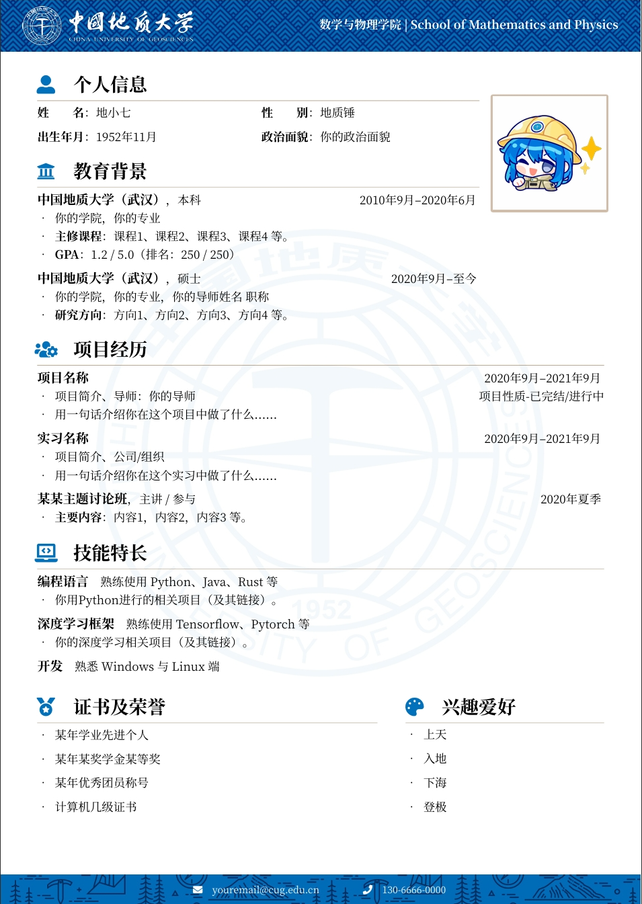

# CUG-CV：中国地质大学（武汉） LaTeX 中文简历模板

## 简介

本模板基于：

- [WHU 中文 CV 模板](https://www.overleaf.com/latex/templates/whuwu-han-da-xue-zhong-wen-jian-li-mo-ban/dbkvxrqjmzpd)
- [NPU 中文 CV 模板](https://www.overleaf.com/latex/templates/npu-cv/mncqzxhvfzrx)
- [SEU 中文 CV 模板](https://github.com/Exception0x0194/SEU-CV) 

在原有内容的基础上进行了修改：

- 调整了部分图标及表述。
- 更改了校徽图标及配色方案，绘制新的背景装饰图案（参考 [中国地质大学（武汉）形象标识系统](https://vis.cug.edu.cn/)）
- 更改了字体（`思源宋体`，已内置在项目文件夹中）

版权声明：
本模板使用的图片资源除默认头像外来自 [中国地质大学（武汉）形象标识系统](https://vis.cug.edu.cn/)，默认头像图片来源为网络，如有侵权请联系删除。

## 使用方法

- 编辑 `main.tex` 中的内容，对文档样式和内容进行修改。
- 使用 `XeLaTeX` 或 `LuaLaTeX` 编译。

## 许可证
[CC BY 4.0](https://creativecommons.org/licenses/by/4.0/) 
